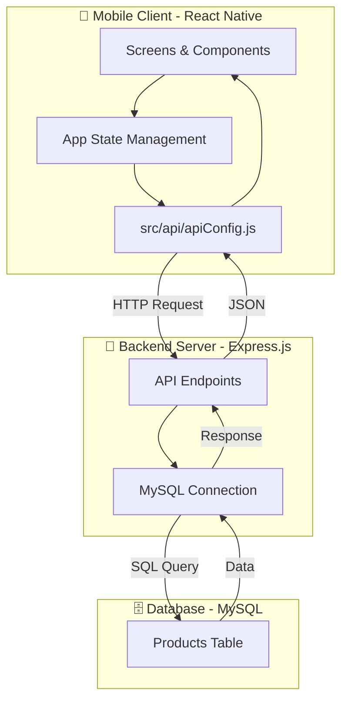

# 🌸 Beautify Petals - Premium Beauty Store

Beautify Petals is a sophisticated, full-stack mobile application designed for a premium beauty product shopping experience. Built with **React Native (Expo)** and a robust **Express.js** backend, it offers a seamless interface for users to browse, explore, and manage their favorite beauty products.

---

## 🏗️ Project Architecture

The project follows a decoupled client-server architecture, ensuring scalability and clean separation of concerns.

### 🏛️ High-Level Overview



### 📂 Directory Structure

```bash
Task1/
├── 📱 App.js              # Entry point & State-based Navigation
├── 🎨 screens/            # UI Screens
│   ├── BeautifyPetals.js  # Main Shop & Listing Screen
│   └── ProductDetails.js  # Detailed Product View
├── 🛠️ src/
│   └── api/
│       └── apiConfig.js   # API Base URL Configuration
└── 💻 backend/            # Express.js Server
    ├── server.js          # API Routes & DB Logic
    └── setup_database.sql # MySQL Schema & Seed Data
```

---

## ✨ Key Features

- **🛍️ Premium UI/UX:** Stunning "Beautify Petals" themed design with a focus on aesthetics.
- **🔍 Product Discovery:** Browse beauty products categorized for easy access.
- **📄 Detailed Insights:** In-depth product descriptions, ratings, and pricing.
- **⚡ Real-time Data:** Integrated with a MySQL backend for dynamic content updates.
- **📱 Responsive Design:** Optimized for both iOS and Android platforms via Expo.

---

## 🛠️ Tech Stack

- **Frontend:** React Native, Expo, React Hooks.
- **Backend:** Node.js, Express.js.
- **Database:** MySQL.
- **Styling:** Vanilla CSS-in-JS (StyleSheet).
- **Communication:** Axios / Fetch API.

---

## 🚀 Getting Started

### 1️⃣ Prerequisites
- **Node.js** installed.
- **Expo Go** app on your mobile device (or an emulator).
- **XAMPP/WAMP** or a local MySQL server.

### 2️⃣ Database Setup
1. Open your MySQL management tool (e.g., phpMyAdmin).
2. Create a database named `beautify petals_db`.
3. Import the `backend/setup_database.sql` file.

### 3️⃣ Backend Installation
```bash
cd backend
npm install
node server.js
```
*The server will start on `http://localhost:3000`.*

### 4️⃣ Mobile App Installation
1. Update `src/api/apiConfig.js` with your local IP address.
2. Install dependencies and start:
```bash
npm install
npx expo start
```
3. Scan the QR code using the Expo Go app.

---

## 🛡️ API Endpoints

| Method | Endpoint | Description |
| :--- | :--- | :--- |
| **GET** | `/products` | Fetch all beauty products |
| **GET** | `/products/:id` | Fetch details of a specific product |

---

## 💎 Design Philosophy

Beautify Petals uses a curated palette of soft pinks, plums, and whites to evoke a sense of luxury and cleanliness. The typography and spacing are meticulously chosen to provide a premium "boutique" feel.

---

*Developed with ❤️ for Advanced Web & App Development.*
